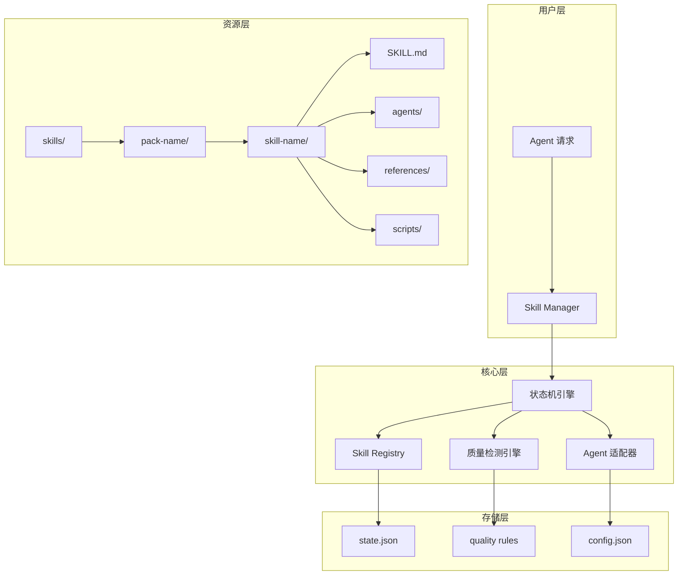
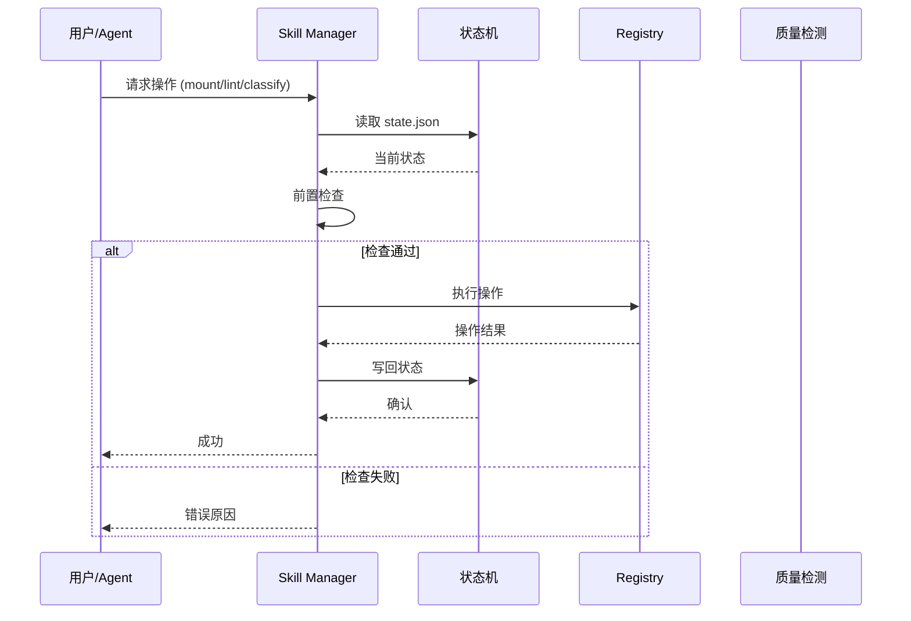
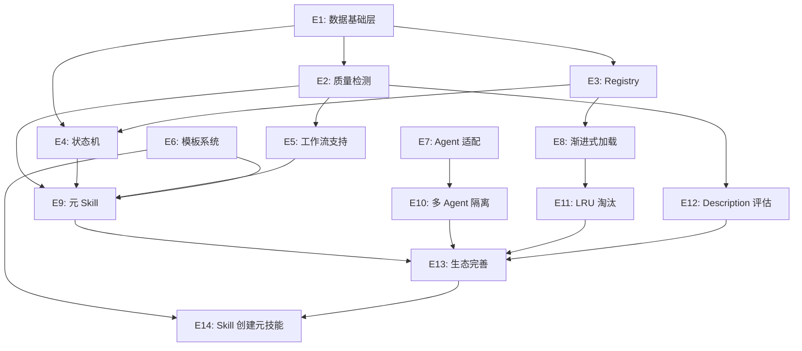
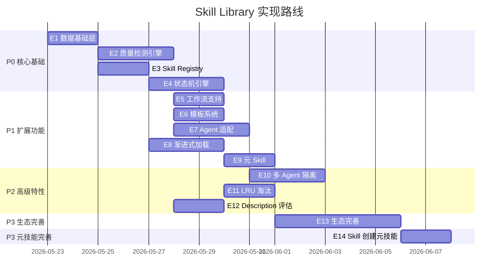
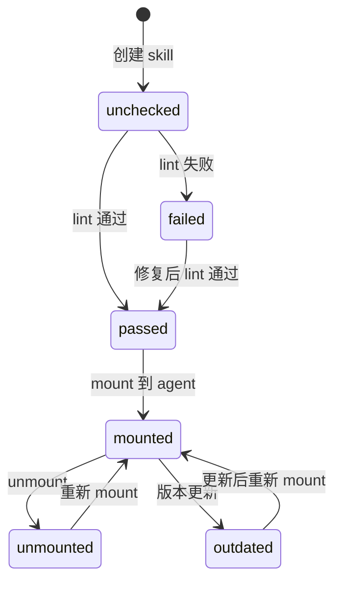
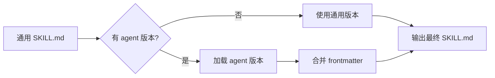
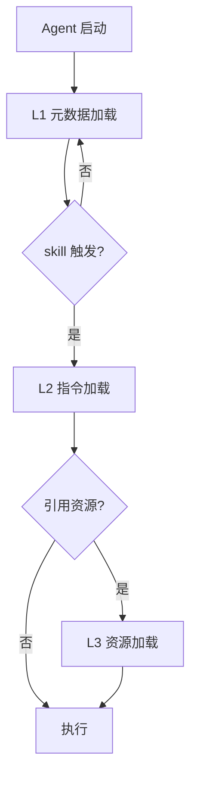

# Skill Library 实现技术文档

> 版本：1.7.0 | 更新：2026-05-23 | 对齐：PRD v1.8.0

## 0. 文档索引

| 文档 | 用途 |
|------|------|
| PRD.md | 产品需求（What + Why） |
| IMPLEMENTATION.md | 实现技术（How） |
| PROGRESS.md | 开发进度跟踪（Status） |
| CLAUDE.md | 开发规则（Rules） |

## 1. 系统架构

### 1.1 整体架构



### 1.2 核心模块

| 模块 | 职责 | 输入 | 输出 |
|------|------|------|------|
| **Skill Manager** | 元 skill SKILL.md，指导 AI 直接操作文件/state | SKILL.md 指令 | 文件操作 + 状态变更 |
| **状态机引擎** | 读→检查→执行→写 | 操作请求 | 状态变更 |
| **Skill Registry** | skill 注册索引 | skill 目录 | 索引条目 |
| **质量检测引擎** | lint 规则执行 | skill 目录 | 检测报告 |
| **Agent 适配器** | 多 agent 格式转换 | 通用 SKILL.md | agent 专属版本 |

### 1.3 数据流



---

## 2. 实现路线

> 详细进度跟踪见 `PROGRESS.md`

### 2.1 Epic 总览

| Epic | 主题 | Story 数 | 依赖 | 优先级 |
|------|------|----------|------|--------|
| E1 | 数据基础层 | 5 | - | P0 |
| E2 | 质量检测引擎 | 8 | E1 | P0 |
| E3 | Skill Registry | 6 | E1 | P0 |
| E4 | 状态机引擎 | 8 | E1, E3 | P0 |
| E5 | 工作流 Skill 支持 | 5 | E2, E3 | P1 |
| E6 | Skill 模板系统 | 4 | - | P1 |
| E7 | Agent 适配框架 | 7 | - | P1 |
| E8 | 渐进式加载 | 6 | E3 | P1 |
| E9 | Skill Manager 元 Skill | 4 | E2, E4, E5, E6 | P1 |
| E10 | 多 Agent 隔离 | 4 | E7 | P2 |
| E11 | LRU 淘汰策略 | 4 | E8 | P2 |
| E12 | Description 质量评估 | 4 | E2 | P2 |
| E13 | 生态完善 | 4 | E9, E10, E11, E12 | P3 |
| E14 | Skill 创建元技能 | 2 | E6, E13 | P3 |

### 2.2 依赖关系



### 2.3 实现阶段



---

## 3. 技术选型

### 3.1 核心技术栈

| 层级 | 技术 | 理由 |
|------|------|------|
| **语言** | Python 3.11+ | 跨平台、生态丰富、快速原型 |
| **数据格式** | JSON | state.json/config.json，易读易解析 |
| **文档格式** | Markdown + YAML | SKILL.md 标准格式 |
| **版本控制** | Git | skill 版本管理、变更追踪 |
| **测试框架** | pytest | 单元测试、集成测试 |

### 3.2 依赖清单

```python
# requirements.txt
pyyaml>=6.0          # YAML 解析
jsonschema>=4.0      # JSON 校验
gitpython>=3.0       # Git 操作
```

### 3.3 外部集成

| 集成点 | 方式 | 用途 |
|--------|------|------|
| Git | GitPython | skill 版本管理 |
| Agent CLI | 文件系统 | skill 安装路径 |
| GitHub | REST API | skill 远程仓库（P3） |

---

## 4. 关键模块设计

### 4.1 状态机引擎

**职责**：所有管理操作的 single source of truth

**核心流程**：
```
读取 state.json
    ↓
前置检查（skill 存在？agent 存在？状态合法？）
    ↓
执行操作（写入新状态）
    ↓
写回 state.json
```

**状态转换规则**：



**接口设计**：

```python
class StateMachine:
    def __init__(self, state_path: str):
        self.state = self._load(state_path)

    def read(self) -> dict:
        """读取当前状态"""

    def write(self, new_state: dict) -> None:
        """写回状态"""

    def check_precondition(self, operation: str, **kwargs) -> bool:
        """前置检查"""

    def execute(self, operation: str, **kwargs) -> dict:
        """执行操作（读→检查→执行→写）"""
```

### 4.2 Skill Registry

**职责**：skill 注册、索引、查询

**索引结构**（state.json `skills` 段）：

```json
{
  "skills": {
    "skill-name": {
      "pack": "development",
      "type": "atomic",
      "design-pattern": "tool-wrapper",
      "skill-type": "technical",
      "version": "1.0.0",
      "quality-status": "passed",
      "agent-adapters": ["claude-code"],
      "default-adapter": "generic",
      "mounted-to": ["agent-id-1"]
    }
  }
}
```

**核心操作**：

```python
class SkillRegistry:
    def scan(self, skills_dir: str) -> list[Path]:
        """扫描目录，返回含 SKILL.md 的子目录列表"""

    def register(self, skill_path: str) -> dict:
        """注册新 skill（parse + 写入 state.json）"""

    def unregister(self, skill_name: str) -> None:
        """注销 skill"""

    def query(self, **filters) -> list:
        """查询 skill（按 pack/type/pattern 等过滤）"""

    def get_skill_path(self, skill_name: str, agent_id: str = None) -> str:
        """获取 skill 路径（含 agent 适配降级）"""
```

**注册流程**（skill-based）：`skill-manager SKILL.md` 指导 AI 调用 `scan_skills()` → `parse_skill_md()` → `state["skills"][name] = {...}` → 原子写入 state.json。

### 4.3 质量检测引擎

**职责**：执行 lint 规则，输出检测报告。对齐 [Agent Skills 开放标准](https://agentskills.io/specification)，通过 profile 机制适配不同 skill 格式。

**Profile 机制**：`lint_atomic(skill_path, profile='skill-library')` 按 profile 切换规则集：

| 规则 | generic | skill-library（默认） | claude-code |
|------|---------|---------------------|-------------|
| name 格式 | ERROR | ERROR | ERROR |
| description 非空 | ERROR | ERROR | ERROR |
| description 触发短语 | 关键词即可 | 引号内触发短语 | 检查 triggers 数组 |
| 第三人称 | 跳过 | WARNING | 跳过 |
| allowed-tools | 跳过 | WARNING | 跳过 |
| metadata flat | 跳过 | WARNING | 跳过 |
| pack/design-pattern/skill-type | 跳过 | WARNING | 跳过 |
| body 长度 | WARNING | WARNING | WARNING |
| references 有效性 | ERROR | ERROR | ERROR |
| 膨胀检测 | WARNING | WARNING | WARNING |

**解析器**：统一使用 `yaml.safe_load`（registry.parser）解析 frontmatter，支持完整 YAML 语法（嵌套、缩进多行、数组对象）。

**原子 skill 7 项规则**：

| # | 规则 | 实现 | 级别 |
|---|------|------|------|
| 1 | name 格式 | 正则 `^[a-z][a-z0-9-]{0,62}[a-z0-9]$` + 目录名一致性 | ERROR |
| 2 | description 长度 | `1 <= len(desc) <= 1024` | ERROR |
| 3 | description 触发词 | 按 profile：引号内短语 / triggers 字段 / 关键词 | WARNING |
| 4 | body 长度 | `len(lines) <= 500` | WARNING |
| 5 | 文件引用有效性 | 扫描 `[text](path)` + 检查文件存在 | ERROR |
| 6 | allowed-tools 格式 | profile=skill-library 时警告 | WARNING |
| 7 | metadata 格式 | profile=skill-library 时检查 flat | WARNING |

**工作流 skill 额外 4 项规则**：

| # | 规则 | 实现 | 级别 |
|---|------|------|------|
| 1 | 引用原子 skill 存在性 | 检查同包内原子 skill | ERROR |
| 2 | 编排步骤完整性 | Pipeline 模式序号连续 | ERROR |
| 3 | 硬性门控标记 | Inversion 模式 STAGE_GATE/HALT | WARNING |
| 4 | 步骤依赖关系 | 拓扑排序检测循环 | ERROR |

**接口设计**：

```python
class QualityEngine:
    def lint_atomic(self, skill_path: str) -> LintResult:
        """原子 skill 7 项检测"""

    def lint_workflow(self, skill_path: str, pack_skills: list) -> LintResult:
        """工作流 skill 4 项额外检测"""

    def check_name_format(self, name: str, dir_name: str) -> bool:
        """检查 name 格式"""

    def check_description_triggers(self, desc: str) -> list:
        """检查 description 触发词"""

    def check_references_valid(self, skill_path: str, body: str) -> list:
        """检查文件引用有效性"""
```

### 4.4 Agent 适配器

**职责**：处理不同 agent 的格式差异

**适配流程**：



**Claude Code 适配**：

```python
class ClaudeCodeAdapter:
    EXTENSION_FIELDS = [
        "disable-model-invocation",
        "user-invocable",
        "context",
        "agent",
        "model",
        "argument-hint"
    ]

    def adapt(self, generic_skill: dict) -> dict:
        """转换为 Claude Code 格式"""

    def merge_frontmatter(self, generic: dict, extension: dict) -> dict:
        """合并通用 + 扩展字段"""

    def inject_dynamic_context(self, body: str) -> str:
        """处理 !command 动态注入"""

    def resolve_placeholders(self, body: str, args: dict) -> str:
        """处理 $ARGUMENTS 占位符"""
```

### 4.5 渐进式加载器

**职责**：实现三级加载机制

**加载层级**：



**接口设计**：

```python
class ProgressiveLoader:
    def load_metadata(self, skills_dir: str) -> list:
        """L1: 加载所有 skill 的 name + description"""

    def load_instructions(self, skill_path: str) -> str:
        """L2: 加载完整 SKILL.md body"""

    def load_resources(self, skill_path: str, refs: list) -> dict:
        """L3: 按需加载 references/scripts/assets"""

    def estimate_tokens(self, content: str) -> int:
        """估算 token 数"""
```

### 4.6 Skill 创建元技能（E14）

**职责**：指导 AI Agent 创建符合项目标准的新 skill

**两个元技能**：

| 元技能 | 类型 | 设计模式 | 包 | 说明 |
|--------|------|----------|-----|------|
| skill-creator | atomic | generator | meta | 创建原子 skill，~300 行 body |
| workflow-creator | atomic | generator | meta | 创建工作流(pipeline/inversion)，~300 行 body |

**skill-creator 流程**：

```
需求澄清(name/pack/pattern/category)
    ↓
目录脚手架(skills/<pack>/<name>/ + references/scripts/assets/)
    ↓
Frontmatter 编写(name/description/version/allowed-tools)
    ↓
Description 编写(第三人称 + 引号触发短语)
    ↓
Body 编写(祈使句, ≤500 行/5000 词)
    ↓
References 拆分(详细内容移出 body)
    ↓
自验证(python -m skill_library.quality.lint)

**workflow-creator 流程**：

```
模式选择(pipeline | inversion)
    ↓
同包原子 skill 检查(引用的 skill 必须存在)
    ↓
目录脚手架
    ↓
步骤编排(序号连续, 引用原子 skill)
    ↓
门控标记(Inversion: STAGE_GATE / Pipeline: 步骤检查点)
    ↓
循环依赖检测
    ↓
自验证(python -m skill_library.quality.lint, 触发工作流 4 项规则)
```

**设计要点**：
- 遵循已有 community 模板风格（data-validator / web-researcher / code-reviewer）
- References 存放详细规范，SKILL.md body 聚焦引导流程
- 创建完成后自动触发 lint 验证

---

## 5. 目录结构实现

### 5.1 项目目录

```
Skill Library/
├── CLAUDE.md                   # 开发规则
├── PRD.md                      # 产品需求
├── IMPLEMENTATION.md           # 本文件
├── README.md                   # 项目入口
├── PROGRESS.md                 # 开发进度
├── docs-alignment.json         # 文档对齐状态
├── config.json                 # 技能库配置
├── state.json                  # 状态机（运行时）
├── pyproject.toml              # 包构建配置
├── requirements.txt            # Python 依赖
├── .gitignore
├── epics/                      # Epic/Story 需求文档
│   ├── E1-data-foundation/
│   ├── E2-quality-engine/
│   ├── ...
│   └── E13-ecosystem/
├── src/skill_library/          # 源码（setuptools 从 src/ 发现包）
│   ├── __init__.py
│   ├── state/                  # 状态机引擎
│   │   ├── machine.py          # 状态机（含 agent 注册/隔离）
│   │   ├── manager.py          # 状态管理
│   │   ├── config.py           # 配置验证
│   │   ├── enums.py            # 枚举定义
│   │   └── *.schema.json       # JSON Schema
│   ├── quality/                # 质量检测引擎
│   │   ├── lint.py             # lint 入口（原子 7 项 + 工作流 4 项）
│   │   ├── models.py           # 数据模型
│   │   ├── description_quality.py  # Description 质量评估
│   │   └── rules/              # 规则实现
│   │       ├── name_format.py
│   │       ├── description.py
│   │       ├── body_length.py
│   │       ├── references.py
│   │       ├── allowed_tools.py
│   │       ├── metadata.py
│   │       ├── bloat.py        # 膨胀检测（E13-S2）
│   │       └── workflow_*.py   # 工作流 4 项规则
│   ├── registry/               # Skill 注册表
│   │   ├── scanner.py          # 目录扫描
│   │   ├── indexer.py          # 索引（含按 agent 查询）
│   │   └── parser.py           # SKILL.md 解析
│   ├── loader/                 # 渐进式加载
│   │   ├── metadata.py         # L1 元数据加载
│   │   ├── instructions.py     # L2 指令加载
│   │   ├── resources.py        # L3 资源加载
│   │   ├── token_estimator.py  # Token 估算
│   │   ├── lifecycle.py        # 加载生命周期管理
│   │   └── eviction.py         # LRU 淘汰策略
│   ├── adapters/               # Agent 适配
│   │   ├── base.py             # 适配器基类
│   │   ├── generic.py          # 通用适配
│   │   ├── claude_code.py      # Claude Code 适配
│   │   └── registry.py         # 适配器注册
│   └── templates/              # 模板引擎
│       └── engine.py           # 原子/工作流模板生成
├── skills/                     # Skill 仓库
│   └── skill-manager/          # 元 skill（自管理）
│       ├── SKILL.md
│       ├── references/cli-examples.md
│       └── scripts/scan-and-register.sh
├── templates/community/        # 社区模板库
│   ├── data-validator/SKILL.md
│   ├── web-researcher/SKILL.md
│   └── code-reviewer/SKILL.md
├── research/                   # 调研文档
│   ├── claude-code-skill-format.md
│   └── skill-classification-and-quality.md
└── tests/                      # 测试
    ├── test_state/             # 含 agent 注册/查询/配置验证
    ├── test_quality/           # 含 bloat + description_quality
    ├── test_registry/
    ├── test_loader/            # 含 eviction
    ├── test_adapters/
    └── test_templates/
```

### 5.2 关键文件说明

| 文件 | 用途 | 格式 |
|------|------|------|
| `pyproject.toml` | 包构建配置（setuptools + entry_points） | TOML |
| `config.json` | 技能库配置（路径、agent 信息） | JSON |
| `state.json` | 状态机（single source of truth） | JSON |
| `src/skill_library/quality/lint.py` | lint 入口（11 项规则 + 膨胀检测） | Python |
| `src/skill_library/loader/eviction.py` | LRU 淘汰器 | Python |

---

## 6. 接口规范

### 6.1 状态机操作接口

```python
# 状态机核心接口
class StateMachine:
    def init(self, library_path: str, agents: dict) -> None:
        """初始化 config.json + state.json"""

    def mount(self, skill_name: str, agent_id: str) -> dict:
        """挂载 skill 到 agent"""

    def unmount(self, skill_name: str, agent_id: str) -> dict:
        """从 agent 卸载 skill"""

    def classify(self, skill_name: str, pack: str, **kwargs) -> dict:
        """分类 skill"""

    def lint(self, skill_name: str) -> dict:
        """执行质量检测"""

    def status(self, skill_name: str = None, agent_id: str = None) -> dict:
        """查询状态"""
```

### 6.2 质量检测接口

```python
# 质量检测接口
class QualityEngine:
    def lint(self, skill_path: str, skill_type: str = "atomic") -> LintResult:
        """执行 lint 检测"""

@dataclass
class LintResult:
    passed: bool
    errors: list[LintError]
    warnings: list[LintWarning]
    score: int  # 0-100

@dataclass
class LintError:
    rule: str
    message: str
    line: int = None
    file: str = None
```

### 6.3 Agent 适配接口

```python
# Agent 适配接口
class AgentAdapter(ABC):
    @abstractmethod
    def adapt(self, generic_skill: dict) -> dict:
        """转换通用 skill 为 agent 专属格式"""

    @abstractmethod
    def get_install_path(self, agent_id: str, skill_name: str) -> str:
        """获取安装路径"""

    @abstractmethod
    def validate(self, skill: dict) -> bool:
        """校验 agent 格式兼容性"""
```

---

## 7. 测试策略

### 7.1 测试层级

| 层级 | 范围 | 工具 | 覆盖率目标 |
|------|------|------|-----------|
| 单元测试 | 单个函数/类 | pytest | ≥ 80% |
| 集成测试 | 模块间交互 | pytest + fixtures | ≥ 60% |
| 端到端测试 | 完整流程 | pytest + 临时目录 | 核心流程 100% |

### 7.2 关键测试用例

```python
# 质量检测测试
def test_name_format_valid():
    assert check_name_format("skill-name", "skill-name") == True

def test_name_format_invalid_uppercase():
    assert check_name_format("Skill-Name", "skill-name") == False

def test_description_triggers():
    desc = 'Use when user asks to "create a skill" or "add a new skill"'
    assert check_description_triggers(desc) == []

# 状态机测试
def test_mount_lint_passed():
    sm = StateMachine(test_state)
    sm.register("test-skill", quality_status="passed")
    result = sm.mount("test-skill", "agent-1")
    assert result["status"] == "mounted"

def test_mount_lint_failed():
    sm = StateMachine(test_state)
    sm.register("test-skill", quality_status="failed")
    with pytest.raises(PreconditionError):
        sm.mount("test-skill", "agent-1")

# Agent 适配测试
def test_claude_code_adapter():
    adapter = ClaudeCodeAdapter()
    generic = {"name": "test", "description": "...", "body": "..."}
    result = adapter.adapt(generic)
    assert "disable-model-invocation" in result or True  # 可选字段
```

---

## 8. 部署与使用

### 8.1 安装

```bash
# 克隆仓库
git clone https://github.com/user/skill-library.git
cd skill-library

# 安装 Python 依赖（工具库层必需）
pip install -r requirements.txt
```

### 8.2 使用方式

AI Agent 通过加载 skill-manager/ skill-creator/ workflow-creator 的 SKILL.md 执行管理操作。这是系统的原生接口。

```
# 在 Claude Code 中触发：
"帮我安装这个 skill 到 Claude Code"
  → skill-manager SKILL.md 指导 AI 执行：
     1. 读取 state.json
     2. lint 检查质量
     3. cp -r 复制目录到 ~/.claude/skills/<name>/
     4. 更新 state.json

"卸载这个 skill"
  → skill-manager 指导 AI：rm -rf + 更新 state.json

"检查 skill 质量"
  → skill-manager 指导 AI：Bash 调用 Python 质量引擎
```

---

## 9. CI/CD 与版本管理

### 9.1 持续集成（CI）

CI 流程通过 GitHub Actions 实现，配置文件 `.github/workflows/ci.yml`：

```yaml
# .github/workflows/ci.yml
name: CI
on: [push, pull_request]
jobs:
  test:
    runs-on: ubuntu-latest
    strategy:
      matrix:
        python-version: ["3.11", "3.12"]
    steps:
      - uses: actions/checkout@v4
      - uses: actions/setup-python@v5
        with:
          python-version: ${{ matrix.python-version }}
      - name: Install dependencies
        run: |
          pip install -e ".[dev]"
      - name: Run tests
        run: pytest tests/ -q --tb=short
      - name: Run lint
        run: python -m skill_library.quality.lint skills/*
```

**门禁条件**：
- 所有测试通过（全 Python 版本矩阵）
- Lint score >= 90（所有 skill 包）

### 9.2 版本管理

使用 `bump-my-version` 统一管理版本号，配置文件 `.bumpversion.toml`：

```toml
[tool.bumpversion]
current_version = "0.1.0"
parse = "(?P<major>\\d+)\\.(?P<minor>\\d+)\\.(?P<patch>\\d+)"
serialize = ["{major}.{minor}.{patch}"]
allow_dirty = false

[[tool.bumpversion.files]]
filename = "pyproject.toml"

[[tool.bumpversion.files]]
filename = "src/skill_library/__init__.py"

[[tool.bumpversion.files]]
filename = "docs-alignment.json"
```

版本变更流程：


### 9.3 自动 Release

当 `v*` tag 被推送时触发 Release 工作流 `.github/workflows/release.yml`：

```yaml
# .github/workflows/release.yml
name: Release
on:
  push:
    tags:
      - "v*"
jobs:
  release:
    runs-on: ubuntu-latest
    steps:
      - uses: actions/checkout@v4
        with:
          fetch-depth: 0
      - uses: actions/setup-python@v5
        with:
          python-version: "3.11"
      - name: Build package
        run: |
          pip install build
          python -m build
      - name: Create Release
        uses: softprops/action-gh-release@v2
        with:
          generate_release_notes: true
          files: dist/*
```

### 9.4 技能包版本管理

每个 pack 独立版本化，通过 `skills/<pack>/pack.json` 声明：

| 包 | pack.json 路径 | skill 数 |
|----|---------------|----------|
| meta | `skills/meta/pack.json` | 3 |
| retrieval | `skills/retrieval/pack.json` | 0 |
| web | `skills/web/pack.json` | 0 |
| document | `skills/document/pack.json` | 0 |
| development | `skills/development/pack.json` | 0 |
| devops | `skills/devops/pack.json` | 0 |
| communication | `skills/communication/pack.json` | 0 |
| learning | `skills/learning/pack.json` | 0 |
| security | `skills/security/pack.json` | 0 |
| data | `skills/data/pack.json` | 0 |

pack.json Schema：

```json
{
  "name": "pack-name",
  "version": "semver",
  "description": "简短描述",
  "skills": ["skill-list"],
  "dependencies": ["other-packs"],
  "updated": "ISO-8601"
}
```

**与 state.json 集成**：

state.json 的 `skills.{name}` 段增加 `pack-version` 字段，记录 skill 所属包的版本：

```json
{
  "skills": {
    "skill-manager": {
      "pack": "meta",
      "pack-version": "1.0.0",
      "type": "atomic",
      "version": "1.0.0",
      ...
    }
  }
}
```

### 9.5 升级渠道

两套升级路径：

**路径一：升级脚本（human-first）**

`scripts/upgrade.sh`：
```bash
#!/bin/bash
# 检查最新版本
latest=$(curl -s https://api.github.com/repos/user/skill-library/releases/latest | grep tag_name | cut -d'"' -f4)
current=$(git describe --tags)
if [ "$latest" != "$current" ]; then
  echo "Upgrade available: $current → $latest"
  git pull origin main
  pip install -r requirements.txt
fi
```

`scripts/upgrade.ps1`（等效 PowerShell 版本）。

**路径二：skill-manager 升级工作流（agent-first）**

skill-manager SKILL.md 中增加升级工作流，指导 AI Agent 执行：
1. 读取本地 `git describe --tags` 获取当前版本
2. 通过 GitHub API 查询最新 Release 版本
3. 版本对比，有更新时执行 `git pull` + `pip install -r requirements.txt`

---

## 10. 参考来源

| 来源 | 说明 | 可信度 |
|------|------|--------|
| agentskills.io/specification | Agent Skills 官方规范 | 🥇 |
| Nacos Skill Registry | 企业级 skill 注册中心 | 🥇 |
| agentskills (Rust) | GitHub 驱动的包管理器 | 🥈 |
| PRD.md | 本项目产品需求 | - |
| research/*.md | 调研文档 | 🥇🥈 |
