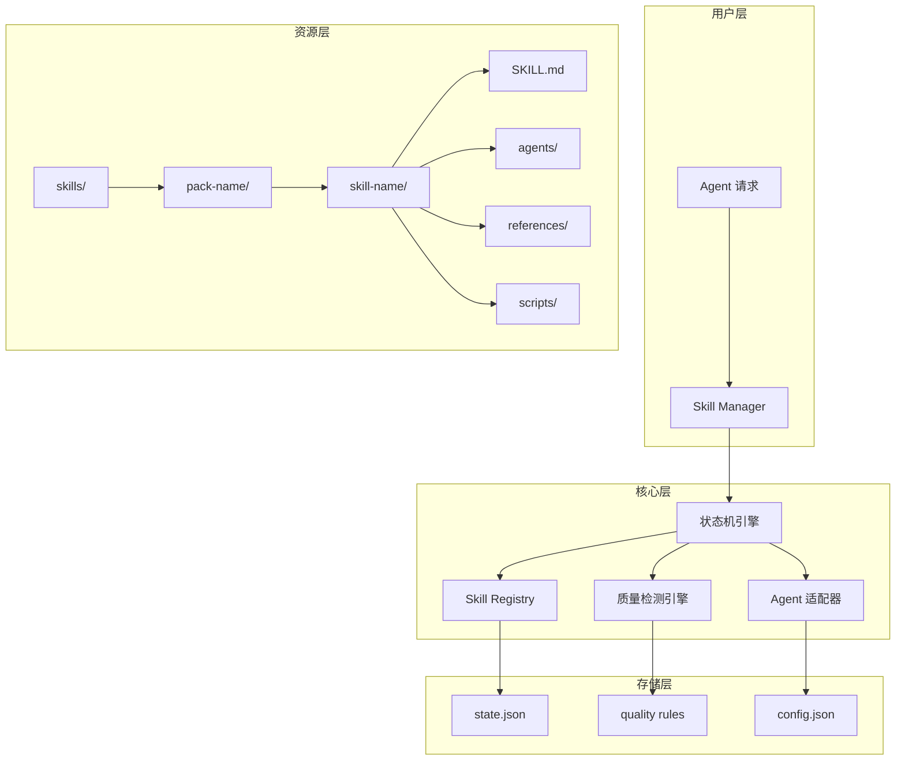
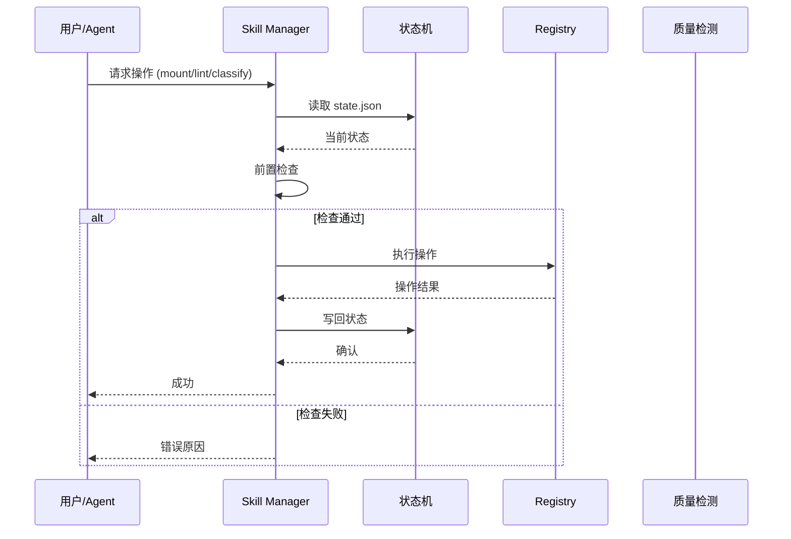
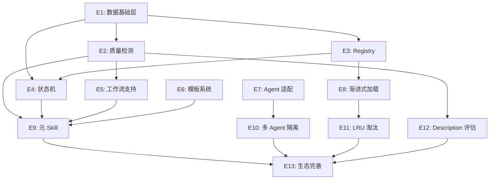
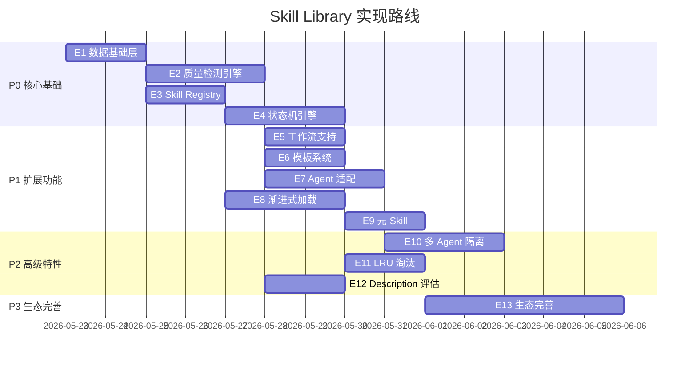
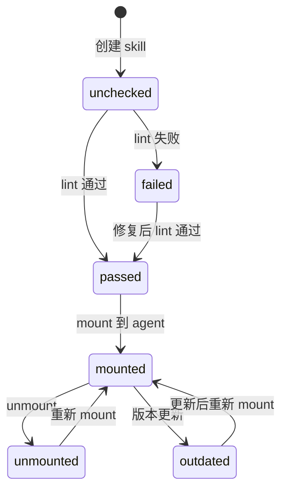
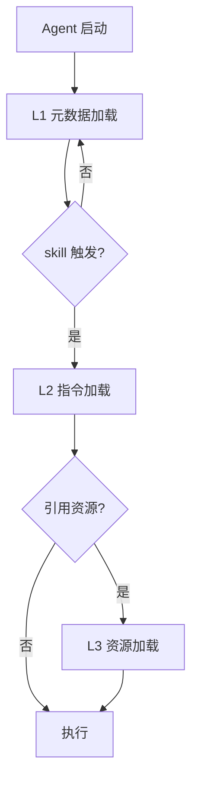

# Skill Library 实现技术文档

> 版本：1.1.0 | 更新：2026-05-22 | 对齐：PRD v1.2.0

## 0. 文档索引

| 文档 | 用途 |
|------|------|
| PRD.md | 产品需求（What + Why） |
| IMPLEMENTATION.md | 实现技术（How） |
| PROGRESS.md | 开发进度跟踪（Status） |
| CLAUDE.md | 开发规则（Rules） |

## 1. 系统架构

### 1.1 整体架构



### 1.2 核心模块

| 模块 | 职责 | 输入 | 输出 |
|------|------|------|------|
| **Skill Manager** | 元 skill，管理入口 | 用户指令 | 操作结果 |
| **状态机引擎** | 读→检查→执行→写 | 操作请求 | 状态变更 |
| **Skill Registry** | skill 注册索引 | skill 目录 | 索引条目 |
| **质量检测引擎** | lint 规则执行 | skill 目录 | 检测报告 |
| **Agent 适配器** | 多 agent 格式转换 | 通用 SKILL.md | agent 专属版本 |

### 1.3 数据流



---

## 2. 实现路线

> 详细进度跟踪见 `PROGRESS.md`

### 2.1 Epic 总览

| Epic | 主题 | Story 数 | 依赖 | 优先级 |
|------|------|----------|------|--------|
| E1 | 数据基础层 | 5 | - | P0 |
| E2 | 质量检测引擎 | 8 | E1 | P0 |
| E3 | Skill Registry | 6 | E1 | P0 |
| E4 | 状态机引擎 | 8 | E1, E3 | P0 |
| E5 | 工作流 Skill 支持 | 5 | E2, E3 | P1 |
| E6 | Skill 模板系统 | 4 | - | P1 |
| E7 | Agent 适配框架 | 7 | - | P1 |
| E8 | 渐进式加载 | 6 | E3 | P1 |
| E9 | Skill Manager 元 Skill | 4 | E2, E4, E5, E6 | P1 |
| E10 | 多 Agent 隔离 | 4 | E7 | P2 |
| E11 | LRU 淘汰策略 | 4 | E8 | P2 |
| E12 | Description 质量评估 | 4 | E2 | P2 |
| E13 | 生态完善 | 4 | E9, E10, E11, E12 | P3 |

### 2.2 依赖关系



### 2.3 实现阶段



---

## 3. 技术选型

### 3.1 核心技术栈

| 层级 | 技术 | 理由 |
|------|------|------|
| **语言** | Python 3.11+ | 跨平台、生态丰富、快速原型 |
| **数据格式** | JSON | state.json/config.json，易读易解析 |
| **文档格式** | Markdown + YAML | SKILL.md 标准格式 |
| **版本控制** | Git | skill 版本管理、变更追踪 |
| **CLI 框架** | Click / Typer | 命令行工具开发 |
| **测试框架** | pytest | 单元测试、集成测试 |

### 3.2 依赖清单

```python
# requirements.txt
pyyaml>=6.0          # YAML 解析
click>=8.0           # CLI 框架
rich>=13.0           # 终端美化输出
jsonschema>=4.0      # JSON 校验
gitpython>=3.0       # Git 操作
```

### 3.3 外部集成

| 集成点 | 方式 | 用途 |
|--------|------|------|
| Git | GitPython | skill 版本管理 |
| Agent CLI | 文件系统 | skill 安装路径 |
| GitHub | REST API | skill 远程仓库（P3） |

---

## 4. 关键模块设计

### 4.1 状态机引擎

**职责**：所有管理操作的 single source of truth

**核心流程**：
```
读取 state.json
    ↓
前置检查（skill 存在？agent 存在？状态合法？）
    ↓
执行操作（写入新状态）
    ↓
写回 state.json
```

**状态转换规则**：



**接口设计**：

```python
class StateMachine:
    def __init__(self, state_path: str):
        self.state = self._load(state_path)

    def read(self) -> dict:
        """读取当前状态"""

    def write(self, new_state: dict) -> None:
        """写回状态"""

    def check_precondition(self, operation: str, **kwargs) -> bool:
        """前置检查"""

    def execute(self, operation: str, **kwargs) -> dict:
        """执行操作（读→检查→执行→写）"""
```

### 4.2 Skill Registry

**职责**：skill 注册、索引、查询

**索引结构**（state.json `skills` 段）：

```json
{
  "skills": {
    "skill-name": {
      "pack": "development",
      "type": "atomic",
      "design-pattern": "tool-wrapper",
      "skill-type": "technical",
      "version": "1.0.0",
      "quality-status": "passed",
      "agent-adapters": ["claude-code"],
      "default-adapter": "generic",
      "mounted-to": ["agent-id-1"]
    }
  }
}
```

**核心操作**：

```python
class SkillRegistry:
    def scan(self, skills_dir: str) -> dict:
        """扫描 skills/ 目录，建立索引"""

    def register(self, skill_path: str) -> dict:
        """注册新 skill"""

    def unregister(self, skill_name: str) -> None:
        """注销 skill"""

    def query(self, **filters) -> list:
        """查询 skill（按 pack/type/pattern 等过滤）"""

    def get_skill_path(self, skill_name: str, agent_id: str = None) -> str:
        """获取 skill 路径（含 agent 适配降级）"""
```

### 4.3 质量检测引擎

**职责**：执行 lint 规则，输出检测报告

**原子 skill 7 项规则**：

| # | 规则 | 实现 | 级别 |
|---|------|------|------|
| 1 | name 格式 | 正则 `^[a-z][a-z0-9-]{0,62}[a-z0-9]$` + 目录名一致性 | ERROR |
| 2 | description 长度 | `1 <= len(desc) <= 1024` | ERROR |
| 3 | description 触发词 | 检测引号内短语 + 第三人称 | WARNING |
| 4 | body 长度 | `len(lines) <= 500` | WARNING |
| 5 | 文件引用有效性 | 扫描 `[text](path)` + 检查文件存在 | ERROR |
| 6 | allowed-tools 格式 | 空格分隔的工具名列表 | ERROR |
| 7 | metadata 格式 | 键值对映射 + version 语义化 | WARNING |

**工作流 skill 额外 4 项规则**：

| # | 规则 | 实现 | 级别 |
|---|------|------|------|
| 1 | 引用原子 skill 存在性 | 检查同包内原子 skill | ERROR |
| 2 | 编排步骤完整性 | Pipeline 模式序号连续 | ERROR |
| 3 | 硬性门控标记 | Inversion 模式 STAGE_GATE/HALT | WARNING |
| 4 | 步骤依赖关系 | 拓扑排序检测循环 | ERROR |

**接口设计**：

```python
class QualityEngine:
    def lint_atomic(self, skill_path: str) -> LintResult:
        """原子 skill 7 项检测"""

    def lint_workflow(self, skill_path: str, pack_skills: list) -> LintResult:
        """工作流 skill 4 项额外检测"""

    def check_name_format(self, name: str, dir_name: str) -> bool:
        """检查 name 格式"""

    def check_description_triggers(self, desc: str) -> list:
        """检查 description 触发词"""

    def check_references_valid(self, skill_path: str, body: str) -> list:
        """检查文件引用有效性"""
```

### 4.4 Agent 适配器

**职责**：处理不同 agent 的格式差异

**适配流程**：


**Claude Code 适配**：

```python
class ClaudeCodeAdapter:
    EXTENSION_FIELDS = [
        "disable-model-invocation",
        "user-invocable",
        "context",
        "agent",
        "model",
        "argument-hint"
    ]

    def adapt(self, generic_skill: dict) -> dict:
        """转换为 Claude Code 格式"""

    def merge_frontmatter(self, generic: dict, extension: dict) -> dict:
        """合并通用 + 扩展字段"""

    def inject_dynamic_context(self, body: str) -> str:
        """处理 !command 动态注入"""

    def resolve_placeholders(self, body: str, args: dict) -> str:
        """处理 $ARGUMENTS 占位符"""
```

### 4.5 渐进式加载器

**职责**：实现三级加载机制

**加载层级**：



**接口设计**：

```python
class ProgressiveLoader:
    def load_metadata(self, skills_dir: str) -> list:
        """L1: 加载所有 skill 的 name + description"""

    def load_instructions(self, skill_path: str) -> str:
        """L2: 加载完整 SKILL.md body"""

    def load_resources(self, skill_path: str, refs: list) -> dict:
        """L3: 按需加载 references/scripts/assets"""

    def estimate_tokens(self, content: str) -> int:
        """估算 token 数"""
```

---

## 5. 目录结构实现

### 5.1 项目目录

```
Skill Library/
├── CLAUDE.md                   # 开发规则
├── PRD.md                      # 产品需求
├── IMPLEMENTATION.md           # 本文件
├── docs-alignment.json         # 文档对齐状态
├── config.json                 # 技能库配置
├── state.json                  # 状态机
├── requirements.txt            # Python 依赖
├── setup.py                    # 包安装
├── skills/                     # Skill 仓库
│   └── meta/
│       └── skill-manager/      # 元 skill
│           ├── SKILL.md
│           ├── references/
│           └── scripts/
├── quality/                    # 质量检测
│   ├── __init__.py
│   ├── lint_atomic.py          # 原子 skill lint
│   ├── lint_workflow.py        # 工作流 skill lint
│   ├── rules/
│   │   ├── __init__.py
│   │   ├── name_format.py
│   │   ├── description.py
│   │   ├── body_length.py
│   │   ├── references.py
│   │   └── metadata.py
│   └── utils.py
├── registry/                   # Skill 注册
│   ├── __init__.py
│   ├── scanner.py              # 目录扫描
│   ├── indexer.py              # 索引管理
│   └── query.py                # 查询接口
├── adapters/                   # Agent 适配
│   ├── __init__.py
│   ├── base.py                 # 适配器基类
│   ├── claude_code.py          # Claude Code 适配
│   └── hermes.py               # Hermes 适配（P2）
├── loader/                     # 渐进式加载
│   ├── __init__.py
│   ├── metadata.py             # L1 加载
│   ├── instructions.py         # L2 加载
│   └── resources.py            # L3 加载
├── state/                      # 状态机
│   ├── __init__.py
│   ├── machine.py              # 状态机引擎
│   ├── transitions.py          # 状态转换规则
│   └── validators.py           # 前置检查
├── commands/                   # CLI 命令
│   ├── __init__.py
│   ├── init.py
│   ├── mount.py
│   ├── lint.py
│   └── classify.py
├── templates/                  # Skill 模板
│   ├── atomic/
│   │   └── SKILL.md.template
│   └── workflow/
│       └── SKILL.md.template
├── research/                   # 调研文档
│   ├── claude-code-skill-format.md
│   └── skill-classification-and-quality.md
└── tests/                      # 测试
    ├── test_quality.py
    ├── test_registry.py
    ├── test_state.py
    └── test_adapters.py
```

### 5.2 关键文件说明

| 文件 | 用途 | 格式 |
|------|------|------|
| `config.json` | 技能库配置（路径、agent 信息） | JSON |
| `state.json` | 状态机（single source of truth） | JSON |
| `SKILL.md` | skill 主文档 | YAML frontmatter + Markdown |
| `quality/rules/*.py` | lint 规则实现 | Python |
| `adapters/*.py` | agent 适配器 | Python |

---

## 6. 接口规范

### 6.1 状态机操作接口

```python
# 状态机核心接口
class StateMachine:
    def init(self, library_path: str, agents: dict) -> None:
        """初始化 config.json + state.json"""

    def mount(self, skill_name: str, agent_id: str) -> dict:
        """挂载 skill 到 agent"""

    def unmount(self, skill_name: str, agent_id: str) -> dict:
        """从 agent 卸载 skill"""

    def classify(self, skill_name: str, pack: str, **kwargs) -> dict:
        """分类 skill"""

    def lint(self, skill_name: str) -> dict:
        """执行质量检测"""

    def status(self, skill_name: str = None, agent_id: str = None) -> dict:
        """查询状态"""
```

### 6.2 质量检测接口

```python
# 质量检测接口
class QualityEngine:
    def lint(self, skill_path: str, skill_type: str = "atomic") -> LintResult:
        """执行 lint 检测"""

@dataclass
class LintResult:
    passed: bool
    errors: list[LintError]
    warnings: list[LintWarning]
    score: int  # 0-100

@dataclass
class LintError:
    rule: str
    message: str
    line: int = None
    file: str = None
```

### 6.3 Agent 适配接口

```python
# Agent 适配接口
class AgentAdapter(ABC):
    @abstractmethod
    def adapt(self, generic_skill: dict) -> dict:
        """转换通用 skill 为 agent 专属格式"""

    @abstractmethod
    def get_install_path(self, agent_id: str, skill_name: str) -> str:
        """获取安装路径"""

    @abstractmethod
    def validate(self, skill: dict) -> bool:
        """校验 agent 格式兼容性"""
```

---

## 7. 测试策略

### 7.1 测试层级

| 层级 | 范围 | 工具 | 覆盖率目标 |
|------|------|------|-----------|
| 单元测试 | 单个函数/类 | pytest | ≥ 80% |
| 集成测试 | 模块间交互 | pytest + fixtures | ≥ 60% |
| 端到端测试 | 完整流程 | pytest + 临时目录 | 核心流程 100% |

### 7.2 关键测试用例

```python
# 质量检测测试
def test_name_format_valid():
    assert check_name_format("skill-name", "skill-name") == True

def test_name_format_invalid_uppercase():
    assert check_name_format("Skill-Name", "skill-name") == False

def test_description_triggers():
    desc = 'Use when user asks to "create a skill" or "add a new skill"'
    assert check_description_triggers(desc) == []

# 状态机测试
def test_mount_lint_passed():
    sm = StateMachine(test_state)
    sm.register("test-skill", quality_status="passed")
    result = sm.mount("test-skill", "agent-1")
    assert result["status"] == "mounted"

def test_mount_lint_failed():
    sm = StateMachine(test_state)
    sm.register("test-skill", quality_status="failed")
    with pytest.raises(PreconditionError):
        sm.mount("test-skill", "agent-1")

# Agent 适配测试
def test_claude_code_adapter():
    adapter = ClaudeCodeAdapter()
    generic = {"name": "test", "description": "...", "body": "..."}
    result = adapter.adapt(generic)
    assert "disable-model-invocation" in result or True  # 可选字段
```

---

## 8. 部署与使用

### 8.1 安装

```bash
# 克隆仓库
git clone https://github.com/user/skill-library.git
cd skill-library

# 安装依赖
pip install -r requirements.txt

# 安装为 CLI 工具
pip install -e .
```

### 8.2 初始化

```bash
# 初始化技能库
skill-manager init

# 扫描已有 skill
skill-manager scan

# 查看状态
skill-manager status
```

### 8.3 日常使用

```bash
# 创建新 skill
skill-manager create my-skill --pack development --type atomic

# 质量检测
skill-manager lint my-skill

# 挂载到 agent
skill-manager mount my-skill --agent claude-code

# 分类
skill-manager classify my-skill --pack development --pattern tool-wrapper
```

---

## 9. 参考来源

| 来源 | 说明 | 可信度 |
|------|------|--------|
| agentskills.io/specification | Agent Skills 官方规范 | 🥇 |
| Nacos Skill Registry | 企业级 skill 注册中心 | 🥇 |
| agentskills (Rust) | GitHub 驱动的包管理器 | 🥈 |
| PRD.md | 本项目产品需求 | - |
| research/*.md | 调研文档 | 🥇🥈 |
