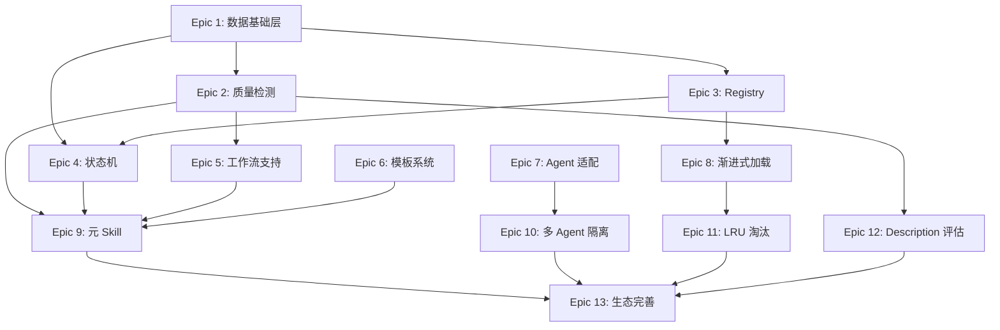

# Skill Library 开发进度

> 版本：1.0.0 | 更新：2026-05-22

## 状态定义

| 状态 | 标记 | 说明 |
|------|------|------|
| 待开发 | `pending` | 已规划，未开始 |
| 正在开发 | `in_progress` | 开发中 |
| 待测试 | `testing` | 开发完成，待验证 |
| 已完成 | `done` | 测试通过，已验收 |
| 阻塞 | `blocked` | 依赖未满足或有问题 |

## 进度总览


---

## Epic 1: 数据基础层

> **主题**：建立 state.json / config.json 数据结构和读写机制，为所有后续功能提供数据基础。

### Story 清单

| ID | Story | 状态 | 依赖 | 验收标准 |
|----|-------|------|------|----------|
| E1-S1 | state.json 三段式结构定义 | `pending` | - | JSON Schema 定义完整，包含 library/agents/skills 三段 |
| E1-S2 | config.json 结构定义 | `pending` | - | 包含 library-path 和 agents 配置 |
| E1-S3 | state.json 读写函数 | `pending` | E1-S1 | load/save 函数，原子写入，异常处理 |
| E1-S4 | config.json 读写函数 | `pending` | E1-S2 | load/save 函数，路径校验 |
| E1-S5 | 状态值枚举定义 | `pending` | - | mount-status/quality-status/type/design-pattern/skill-type/load-mode 全部枚举 |

### 测试门禁

```bash
# 单元测试
pytest tests/test_state.py -v
pytest tests/test_config.py -v

# 验收条件
- [ ] state.json Schema 校验通过
- [ ] config.json Schema 校验通过
- [ ] 读写函数覆盖率 ≥ 90%
- [ ] 异常场景（文件不存在/格式错误）处理正确
```

---

## Epic 2: 质量检测引擎

> **主题**：实现原子 skill 7 项 lint 规则，保障 skill 格式规范。

### Story 清单

| ID | Story | 状态 | 依赖 | 验收标准 |
|----|-------|------|------|----------|
| E2-S1 | name 格式校验规则 | `pending` | - | 正则 `^[a-z][a-z0-9-]{0,62}[a-z0-9]$`，目录名一致性检查 |
| E2-S2 | description 校验规则 | `pending` | - | 长度 1-1024，触发词检测，第三人称检测 |
| E2-S3 | body 长度校验规则 | `pending` | - | 行数 ≤ 500，token 估算 ≤ 5000 |
| E2-S4 | 文件引用有效性校验 | `pending` | - | 扫描 `[text](path)`，检查文件存在 |
| E2-S5 | allowed-tools 格式校验 | `pending` | - | 空格分隔工具名列表 |
| E2-S6 | metadata 格式校验 | `pending` | - | 键值对映射，version 语义化 |
| E2-S7 | lint 结果聚合器 | `pending` | E2-S1~S6 | 输出 LintResult（passed/errors/warnings/score） |
| E2-S8 | lint CLI 命令 | `pending` | E2-S7 | `skill-manager lint <skill-name>` 可执行 |

### 测试门禁

```bash
# 单元测试
pytest tests/test_quality/test_rules.py -v
pytest tests/test_quality/test_lint.py -v

# 验收条件
- [ ] 7 项规则全部实现且有对应测试
- [ ] 正例（合法 skill）全部通过
- [ ] 反例（非法 skill）全部捕获
- [ ] LintResult 输出格式正确
- [ ] CLI 命令可执行，输出可读
```

---

## Epic 3: Skill Registry

> **主题**：实现 skill 目录扫描、注册、索引、查询功能。

### Story 清单

| ID | Story | 状态 | 依赖 | 验收标准 |
|----|-------|------|------|----------|
| E3-S1 | 目录扫描器 | `pending` | E1-S1 | 扫描 skills/ 目录，识别 SKILL.md |
| E3-S2 | frontmatter 解析器 | `pending` | - | 解析 YAML frontmatter，提取 name/description/version 等 |
| E3-S3 | skill 注册函数 | `pending` | E3-S1, E3-S2 | 解析 skill 元数据，写入 state.json skills 段 |
| E3-S4 | skill 注销函数 | `pending` | E1-S3 | 从 state.json 移除 skill 条目 |
| E3-S5 | skill 查询接口 | `pending` | E1-S3 | 按 pack/type/pattern/status 过滤查询 |
| E3-S6 | 二维分类标记 | `pending` | E3-S3 | 支持 design-pattern + skill-type 分类 |

### 测试门禁

```bash
# 单元测试
pytest tests/test_registry/test_scanner.py -v
pytest tests/test_registry/test_indexer.py -v

# 集成测试
pytest tests/test_registry/test_query.py -v

# 验收条件
- [ ] 扫描器能识别标准目录结构
- [ ] frontmatter 解析覆盖所有标准字段
- [ ] 注册/注销操作状态同步正确
- [ ] 查询接口返回格式正确
- [ ] 二维分类字段写入正确
```

---

## Epic 4: 状态机引擎

> **主题**：实现状态机核心逻辑，所有管理操作通过状态机驱动。

### Story 清单

| ID | Story | 状态 | 依赖 | 验收标准 |
|----|-------|------|------|----------|
| E4-S1 | 状态机引擎核心 | `pending` | E1-S3 | read→check→execute→write 流程 |
| E4-S2 | 前置检查器 | `pending` | E1-S5 | 检查 skill 存在、agent 存在、状态合法 |
| E4-S3 | mount 操作 | `pending` | E4-S1, E4-S2 | quality=passed 才能 mount，状态变更正确 |
| E4-S4 | unmount 操作 | `pending` | E4-S1 | mounted→unmounted，mounted-to 清除 |
| E4-S5 | classify 操作 | `pending` | E4-S1 | 写入 pack + type + design-pattern + skill-type |
| E4-S6 | status 查询 | `pending` | E1-S3 | 只读查询，支持按 skill/agent 过滤 |
| E4-S7 | init 初始化 | `pending` | E1-S3, E1-S4 | 创建 config.json + state.json，扫描 skills/ |
| E4-S8 | 异常处理 | `pending` | E4-S1 | 操作失败写入 error 状态，不中断后续操作 |

### 测试门禁

```bash
# 单元测试
pytest tests/test_state/test_machine.py -v
pytest tests/test_state/test_transitions.py -v

# 集成测试
pytest tests/test_state/test_operations.py -v

# 验收条件
- [ ] 状态转换图覆盖所有合法路径
- [ ] 非法状态转换全部拒绝
- [ ] 前置检查覆盖所有操作
- [ ] 异常场景处理正确
- [ ] 状态持久化正确
```

---

## Epic 5: 工作流 Skill 支持

> **主题**：扩展质量检测支持工作流 skill，实现额外 4 项规则。

### Story 清单

| ID | Story | 状态 | 依赖 | 验收标准 |
|----|-------|------|------|----------|
| E5-S1 | 引用原子 skill 存在性校验 | `pending` | E3-S1 | 检查同包内引用的原子 skill 存在 |
| E5-S2 | 编排步骤完整性校验 | `pending` | - | Pipeline 模式序号连续，无缺失 |
| E5-S3 | 硬性门控标记校验 | `pending` | - | Inversion 模式 STAGE_GATE/HALT 标记 |
| E5-S4 | 步骤依赖关系校验 | `pending` | - | 拓扑排序检测循环依赖 |
| E5-S5 | 工作流 lint 入口 | `pending` | E5-S1~S4, E2-S7 | `skill-manager lint-workflow <name>` |

### 测试门禁

```bash
# 单元测试
pytest tests/test_quality/test_workflow_rules.py -v

# 验收条件
- [ ] 4 项规则全部实现且有对应测试
- [ ] 引用存在的原子 skill → 通过
- [ ] 引用不存在的原子 skill → ERROR
- [ ] Pipeline 序号不连续 → ERROR
- [ ] 循环依赖 → ERROR
- [ ] Inversion 无门控标记 → WARNING
```

---

## Epic 6: Skill 模板系统

> **主题**：提供原子 skill 和工作流 skill 的标准化模板，支持快速创建。

### Story 清单

| ID | Story | 状态 | 依赖 | 验收标准 |
|----|-------|------|------|----------|
| E6-S1 | 原子 skill 模板 | `pending` | - | 标准 frontmatter + body 结构 |
| E6-S2 | 工作流 skill 模板 | `pending` | - | Pipeline/Inversion 模式模板 |
| E6-S3 | create 命令 | `pending` | E6-S1, E6-S2 | `skill-manager create <name> --type atomic/workflow` |
| E6-S4 | 模板参数填充 | `pending` | E6-S3 | 自动填充 name/description/pack 等 |

### 测试门禁

```bash
# 验收条件
- [ ] 模板生成的 skill 通过 lint 检测
- [ ] create 命令可执行
- [ ] 参数填充正确
- [ ] 目录结构符合规范
```

---

## Epic 7: Agent 适配框架

> **主题**：实现通用适配器接口和 Claude Code 适配器，支持多 agent 环境。

### Story 清单

| ID | Story | 状态 | 依赖 | 验收标准 |
|----|-------|------|------|----------|
| E7-S1 | AgentAdapter 抽象基类 | `pending` | - | adapt/get_install_path/validate 接口 |
| E7-S2 | 通用 SKILL.md 适配器 | `pending` | E7-S1 | 处理 6 个标准字段 |
| E7-S3 | Claude Code 扩展字段处理 | `pending` | E7-S1 | 处理 6 个扩展字段 |
| E7-S4 | Claude Code 动态注入处理 | `pending` | E7-S3 | `!command` 预执行语法 |
| E7-S5 | Claude Code 参数占位符处理 | `pending` | E7-S3 | `$ARGUMENTS`/`$0`/`$1` |
| E7-S6 | Agent 版本降级逻辑 | `pending` | E7-S1 | 无匹配 agent 版本时降级到通用版本 |
| E7-S7 | 适配器注册表 | `pending` | E7-S1 | 按 agent-type 查找适配器 |

### 测试门禁

```bash
# 单元测试
pytest tests/test_adapters/test_base.py -v
pytest tests/test_adapters/test_claude_code.py -v

# 验收条件
- [ ] 抽象基类接口定义完整
- [ ] Claude Code 扩展字段处理正确
- [ ] 动态注入语法解析正确
- [ ] 参数占位符替换正确
- [ ] 降级逻辑正确
- [ ] 适配器查找正确
```

---

## Epic 8: 渐进式加载

> **主题**：实现三级加载机制，优化 token 使用。

### Story 清单

| ID | Story | 状态 | 依赖 | 验收标准 |
|----|-------|------|------|----------|
| E8-S1 | L1 元数据加载器 | `pending` | E3-S1, E3-S2 | 加载所有 skill 的 name + description |
| E8-S2 | L2 指令加载器 | `pending` | E3-S2 | 加载完整 SKILL.md body |
| E8-S3 | L3 资源加载器 | `pending` | - | 按需加载 references/scripts/assets |
| E8-S4 | Token 估算器 | `pending` | - | 估算内容 token 数 |
| E8-S5 | 加载生命周期管理 | `pending` | E8-S1~S3 | once/turn/session 三种模式 |
| E8-S6 | load CLI 命令 | `pending` | E8-S1 | `skill-manager load --agent <id>` |

### 测试门禁

```bash
# 单元测试
pytest tests/test_loader/test_metadata.py -v
pytest tests/test_loader/test_instructions.py -v
pytest tests/test_loader/test_resources.py -v

# 验收条件
- [ ] L1 加载仅包含 name + description
- [ ] L2 加载完整 body
- [ ] L3 加载按需触发
- [ ] Token 估算误差 ≤ 20%
- [ ] 生命周期模式切换正确
```

---

## Epic 9: Skill Manager 元 Skill

> **主题**：将管理功能本身封装为标准格式的元 skill。

### Story 清单

| ID | Story | 状态 | 依赖 | 验收标准 |
|----|-------|------|------|----------|
| E9-S1 | skill-manager SKILL.md | `pending` | E2-S8, E4-S7 | 标准格式，通过 lint 检测 |
| E9-S2 | skill-manager references | `pending` | - | 操作手册、状态机说明 |
| E9-S3 | skill-manager scripts | `pending` | - | CLI 入口脚本 |
| E9-S4 | 元 skill 自管理验证 | `pending` | E9-S1 | skill-manager 能管理自身 |

### 测试门禁

```bash
# 验收条件
- [ ] SKILL.md 通过 lint 检测
- [ ] description 包含正确触发词
- [ ] 所有命令可执行
- [ ] 元 skill 能管理自身（mount/unmount/lint）
```

---

## Epic 10: 多 Agent 隔离

> **主题**：实现多 agent 环境下的 skill 隔离和状态管理。

### Story 清单

| ID | Story | 状态 | 依赖 | 验收标准 |
|----|-------|------|------|----------|
| E10-S1 | Agent 注册 | `pending` | E1-S2 | 注册 agent-id + path + agent-type |
| E10-S2 | Agent 隔离存储 | `pending` | E1-S3 | agents 段按 agent-id 隔离 |
| E10-S3 | 按 Agent 过滤查询 | `pending` | E3-S5 | 查询某 agent 的所有 mounted skill |
| E10-S4 | Agent 配置验证 | `pending` | E1-S4 | 验证 agent path 存在且可写 |

### 测试门禁

```bash
# 验收条件
- [ ] Agent 注册成功
- [ ] 不同 agent 的 skill 状态互不干扰
- [ ] 按 agent 过滤查询正确
- [ ] Agent 路径验证正确
```

---

## Epic 11: LRU 淘汰策略

> **主题**：实现 skill 加载的 LRU 淘汰机制，控制内存占用。

### Story 清单

| ID | Story | 状态 | 依赖 | 验收标准 |
|----|-------|------|------|----------|
| E11-S1 | 最大加载数配置 | `pending` | - | config.json 支持 max-loaded-skills |
| E11-S2 | LRU 淘汰器 | `pending` | E11-S1, E8-S5 | 超限时淘汰最近最少使用的 skill |
| E11-S3 | last-used 时间戳更新 | `pending` | E1-S3 | 每次使用更新 last-used |
| E11-S4 | 淘汰事件日志 | `pending` | E11-S2 | 记录淘汰的 skill 和时间 |

### 测试门禁

```bash
# 验收条件
- [ ] 超限时触发淘汰
- [ ] 淘汰的是最近最少使用的 skill
- [ ] last-used 更新正确
- [ ] 淘汰日志记录正确
```

---

## Epic 12: Description 质量评估

> **主题**：实现 description 触发率评估，提升 skill 被正确激活的概率。

### Story 清单

| ID | Story | 状态 | 依赖 | 验收标准 |
|----|-------|------|------|----------|
| E12-S1 | 触发词提取器 | `pending` | E2-S2 | 提取引号内短语 |
| E12-S2 | 覆盖率评估 | `pending` | E12-S1 | 评估触发词覆盖用户常见表述 |
| E12-S3 | 第三人称检测 | `pending` | E2-S2 | 检测 "This skill should be used when..." |
| E12-S4 | Description 优化建议 | `pending` | E12-S2 | 输出改进建议 |

### 测试门禁

```bash
# 验收条件
- [ ] 触发词提取正确
- [ ] 覆盖率评估合理
- [ ] 第三人称检测准确
- [ ] 优化建议可操作
```

---

## Epic 13: 生态完善

> **主题**：CLI 工具、Skill 膨胀检测、社区模板等生态功能。

### Story 清单

| ID | Story | 状态 | 依赖 | 验收标准 |
|----|-------|------|------|----------|
| E13-S1 | CLI 入口封装 | `pending` | E2-S8, E4-S7, E6-S3 | 统一 CLI 入口，所有命令可访问 |
| E13-S2 | Skill 膨胀检测 | `pending` | E2-S3 | 检测 body > 500 行的 skill |
| E13-S3 | 社区 skill 模板库 | `pending` | E6-S1, E6-S2 | 多种类型模板 |
| E13-S4 | 版本管理命令 | `pending` | E1-S3 | `skill-manager version <skill> <version>` |

### 测试门禁

```bash
# 验收条件
- [ ] CLI 所有命令可执行
- [ ] 膨胀检测正确
- [ ] 模板库可用
- [ ] 版本管理正确
```

---

## 依赖关系图



---

## 进度更新日志

| 日期 | Epic | Story | 状态变更 | 备注 |
|------|------|-------|----------|------|
| 2026-05-22 | - | - | 初始化 | 文档创建 |
