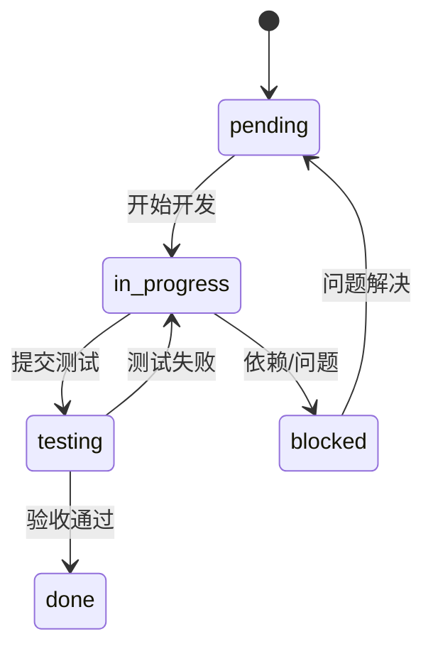
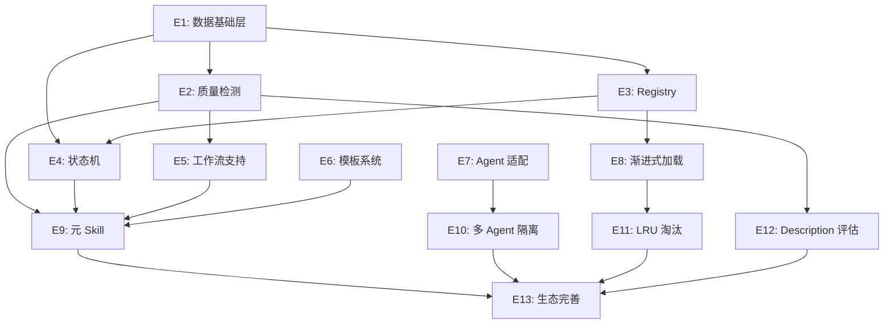

# Skill Library 开发进度

> 版本：1.1.0 | 更新：2026-05-22

## 状态定义

| 状态 | 标记 | 说明 |
|------|------|------|
| 待开发 | `pending` | 已规划，未开始 |
| 正在开发 | `in_progress` | 开发中 |
| 待测试 | `testing` | 开发完成，待验证 |
| 已完成 | `done` | 测试通过，已验收 |
| 阻塞 | `blocked` | 依赖未满足或有问题 |

## 状态转换



## 进度总览

| Epic | 主题 | Story 数 | 状态 | 详情 |
|------|------|----------|------|------|
| E1 | 数据基础层 | 5 | `done` | [EPIC.md](epics/E1-data-foundation/EPIC.md) |
| E2 | 质量检测引擎 | 8 | `done` | [EPIC.md](epics/E2-quality-engine/EPIC.md) |
| E3 | Skill Registry | 6 | `done` | [EPIC.md](epics/E3-skill-registry/EPIC.md) |
| E4 | 状态机引擎 | 8 | `done` | [EPIC.md](epics/E4-state-machine/EPIC.md) |
| E5 | 工作流 Skill 支持 | 5 | `done` | [EPIC.md](epics/E5-workflow-support/EPIC.md) |
| E6 | Skill 模板系统 | 4 | `done` | [EPIC.md](epics/E6-template-system/EPIC.md) |
| E7 | Agent 适配框架 | 7 | `pending` | [EPIC.md](epics/E7-agent-adapter/EPIC.md) |
| E8 | 渐进式加载 | 6 | `pending` | [EPIC.md](epics/E8-progressive-loading/EPIC.md) |
| E9 | Skill Manager 元 Skill | 4 | `pending` | [EPIC.md](epics/E9-meta-skill/EPIC.md) |
| E10 | 多 Agent 隔离 | 4 | `pending` | [EPIC.md](epics/E10-multi-agent/EPIC.md) |
| E11 | LRU 淘汰策略 | 4 | `pending` | [EPIC.md](epics/E11-lru-eviction/EPIC.md) |
| E12 | Description 质量评估 | 4 | `pending` | [EPIC.md](epics/E12-description-quality/EPIC.md) |
| E13 | 生态完善 | 4 | `pending` | [EPIC.md](epics/E13-ecosystem/EPIC.md) |

**总计**：13 个 Epic，69 个 Story

## 文件结构

```
epics/
├── E1-data-foundation/
│   ├── EPIC.md           # Epic 概述
│   ├── S1-state-schema.md    # Story 独立文件
│   ├── S2-config-schema.md
│   ├── S3-state-readwrite.md
│   ├── S4-config-readwrite.md
│   └── S5-enums.md
├── E2-quality-engine/
│   ├── EPIC.md
│   └── S1~S8-*.md
├── ...
└── E13-ecosystem/
    ├── EPIC.md
    └── S1~S4-*.md
```

## 依赖关系



## 进度更新日志

| 日期 | Epic | Story | 状态变更 | 备注 |
|------|------|-------|----------|------|
| 2026-05-22 | - | - | 初始化 | 文档创建，Epic/Story 结构建立 |
| 2026-05-22 | E1 | E1-S1 | pending → in_progress | 开始开发 state.json Schema |
| 2026-05-22 | E1 | E1-S1 | in_progress → done | 23 个测试全部通过 |
| 2026-05-22 | E1 | E1-S2 | pending → in_progress | 开始开发 config.json Schema |
| 2026-05-22 | E1 | E1-S2 | in_progress → done | 10 个测试全部通过 |
| 2026-05-22 | E1 | E1-S3 | pending → in_progress | 开始开发 state.json 读写函数 |
| 2026-05-22 | E1 | E1-S3 | in_progress → done | 12 个测试全部通过 |
| 2026-05-22 | E1 | E1-S4 | pending → in_progress | 开始开发 config.json 读写函数 |
| 2026-05-22 | E1 | E1-S4 | in_progress → done | 16 个测试全部通过 |
| 2026-05-22 | E1 | E1-S5 | pending → in_progress | 开始开发状态值枚举 |
| 2026-05-22 | E1 | E1-S5 | in_progress → done | 18 个测试全部通过 |
| 2026-05-22 | E1 | - | Epic 完成 | 5 个 Story 全部完成，79 个测试通过 |
| 2026-05-22 | E2 | E2-S1~S7 | pending → done | 7 项 lint 规则 + 聚合器完成，44 个测试通过 |
| 2026-05-22 | E2 | E2-S8 | pending → done | lint CLI 命令完成，6 个测试通过 |
| 2026-05-22 | E2 | - | Epic 完成 | 8 个 Story 全部完成，50 个测试通过 |
| 2026-05-22 | E3 | E3-S1~S6 | pending → done | Skill Registry 完成，33 个测试通过 |
| 2026-05-22 | E3 | - | Epic 完成 | 6 个 Story 全部完成，33 个测试通过 |
| 2026-05-22 | E4 | E4-S1~S8 | pending → done | 状态机引擎完成，31 个测试通过 |
| 2026-05-22 | E4 | - | Epic 完成 | 8 个 Story 全部完成，31 个测试通过 |
| 2026-05-22 | E5 | E5-S1~S5 | pending → done | 工作流 4 项规则 + lint 入口完成，15 个测试通过 |
| 2026-05-22 | E5 | - | Epic 完成 | 5 个 Story 全部完成，15 个测试通过 |
| 2026-05-22 | E6 | E6-S1~S4 | pending → done | 模板系统完成，14 个测试通过 |
| 2026-05-22 | E6 | - | Epic 完成 | 4 个 Story 全部完成，14 个测试通过 |
