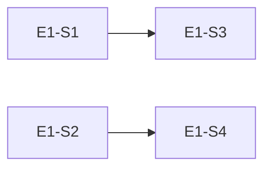

# Epic 1: 数据基础层

> **主题**：建立 state.json / config.json 数据结构和读写机制，为所有后续功能提供数据基础。

## 元数据

| 属性 | 值 |
|------|-----|
| ID | E1 |
| 优先级 | P0 |
| Story 数 | 5 |
| 依赖 | 无 |
| 状态 | `done` |
| 完成时间 | 2026-05-22 |

## Story 列表

| ID | Story | 状态 | 依赖 |
|----|-------|------|------|
| E1-S1 | state.json 三段式结构定义 | `done` | - |
| E1-S2 | config.json 结构定义 | `done` | - |
| E1-S3 | state.json 读写函数 | `done` | E1-S1 |
| E1-S4 | config.json 读写函数 | `done` | E1-S2 |
| E1-S5 | 状态值枚举定义 | `done` | - |

## 测试门禁

```bash
# 单元测试
pytest tests/test_state.py -v
pytest tests/test_config.py -v

# 验收条件
- [ ] state.json Schema 校验通过
- [ ] config.json Schema 校验通过
- [ ] 读写函数覆盖率 ≥ 90%
- [ ] 异常场景（文件不存在/格式错误）处理正确
```

## 依赖关系


