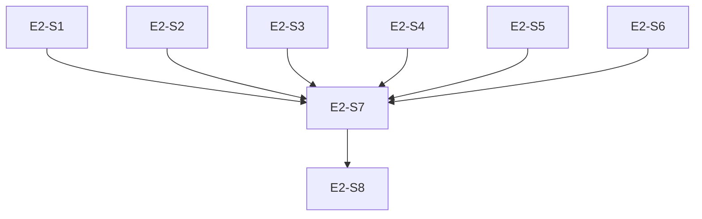

# Epic 2: 质量检测引擎

> **主题**：实现原子 skill 7 项 lint 规则，保障 skill 格式规范。

## 元数据

| 属性 | 值 |
|------|-----|
| ID | E2 |
| 优先级 | P0 |
| Story 数 | 8 |
| 依赖 | E1 |
| 状态 | `done` |

## Story 列表

| ID | Story | 状态 | 依赖 |
|----|-------|------|------|
| E2-S1 | name 格式校验规则 | `done` | - |
| E2-S2 | description 校验规则 | `done` | - |
| E2-S3 | body 长度校验规则 | `done` | - |
| E2-S4 | 文件引用有效性校验 | `done` | - |
| E2-S5 | allowed-tools 格式校验 | `done` | - |
| E2-S6 | metadata 格式校验 | `done` | - |
| E2-S7 | lint 结果聚合器 | `done` | E2-S1~S6 |
| E2-S8 | lint CLI 命令 | `done` | E2-S7 |

## 测试门禁

```bash
# 单元测试
pytest tests/test_quality/test_rules.py -v
pytest tests/test_quality/test_lint.py -v

# 验收条件
- [ ] 7 项规则全部实现且有对应测试
- [ ] 正例（合法 skill）全部通过
- [ ] 反例（非法 skill）全部捕获
- [ ] LintResult 输出格式正确
- [ ] CLI 命令可执行，输出可读
```

## 依赖关系


