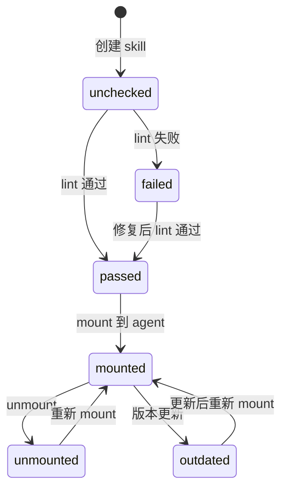

# Epic 4: 状态机引擎

> **主题**：实现状态机核心逻辑，所有管理操作通过状态机驱动。

## 元数据

| 属性 | 值 |
|------|-----|
| ID | E4 |
| 优先级 | P0 |
| Story 数 | 8 |
| 依赖 | E1, E3 |
| 状态 | `done` |

## Story 列表

| ID | Story | 状态 | 依赖 |
|----|-------|------|------|
| E4-S1 | 状态机引擎核心 | `done` | E1-S3 |
| E4-S2 | 前置检查器 | `done` | E1-S5 |
| E4-S3 | mount 操作 | `done` | E4-S1, E4-S2 |
| E4-S4 | unmount 操作 | `done` | E4-S1 |
| E4-S5 | classify 操作 | `done` | E4-S1 |
| E4-S6 | status 查询 | `done` | E1-S3 |
| E4-S7 | init 初始化 | `done` | E1-S3, E1-S4 |
| E4-S8 | 异常处理 | `done` | E4-S1 |

## 测试门禁

```bash
# 单元测试
pytest tests/test_state/test_machine.py -v
pytest tests/test_state/test_transitions.py -v

# 集成测试
pytest tests/test_state/test_operations.py -v

# 验收条件
- [ ] 状态转换图覆盖所有合法路径
- [ ] 非法状态转换全部拒绝
- [ ] 前置检查覆盖所有操作
- [ ] 异常场景处理正确
- [ ] 状态持久化正确
```

## 状态转换图


