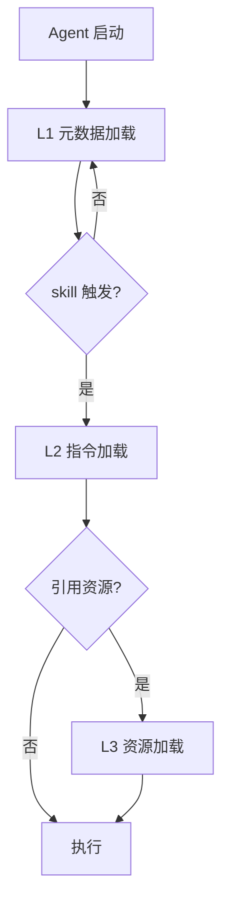

# Epic 8: 渐进式加载

> **主题**：实现三级加载机制，优化 token 使用。

## 元数据

| 属性 | 值 |
|------|-----|
| ID | E8 |
| 优先级 | P1 |
| Story 数 | 6 |
| 依赖 | E3 |
| 状态 | `done` |

## Story 列表

| ID | Story | 状态 | 依赖 |
|----|-------|------|------|
| E8-S1 | L1 元数据加载器 | `done` | E3-S1, E3-S2 |
| E8-S2 | L2 指令加载器 | `done` | E3-S2 |
| E8-S3 | L3 资源加载器 | `done` | - |
| E8-S4 | Token 估算器 | `done` | - |
| E8-S5 | 加载生命周期管理 | `done` | E8-S1~S3 |
| E8-S6 | load CLI 命令 | `done` | E8-S1 |

## 测试门禁

```bash
# 单元测试
pytest tests/test_loader/test_metadata.py -v
pytest tests/test_loader/test_instructions.py -v
pytest tests/test_loader/test_resources.py -v

# 验收条件
- [ ] L1 加载仅包含 name + description
- [ ] L2 加载完整 body
- [ ] L3 加载按需触发
- [ ] Token 估算误差 ≤ 20%
- [ ] 生命周期模式切换正确
```

## 加载层级


