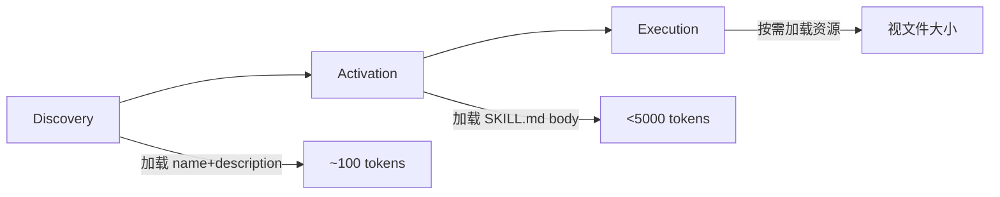

# Claude Code Skill 格式规范调研

> 版本：1.1.0 | 更新：2026-05-22 | 来源交叉验证：3+ 独立来源

## 一、Agent Skills 开放标准概述

### 1.1 标准来源

| 项目 | 说明 |
|------|------|
| 主导方 | Anthropic |
| 发布时间 | 2025 年 12 月 |
| 官方规范 | agentskills.io/specification |
| GitHub | agentskills/agentskills（14.8k Stars） |
| 官方示例库 | anthropics/skills（109k Stars） |

Agent Skills 是 Anthropic 主导的开放规范，用于为 AI Agent 动态添加专业能力。与 MCP 互补——MCP 解决"能调什么工具"，Skills 解决"怎么完成任务流程"。

### 1.2 支持的客户端

| 客户端 | 说明 |
|--------|------|
| Claude Code | Anthropic 官方，主要实现者 |
| OpenAI Codex CLI | 已采纳 |
| ChatGPT | 已采纳 |
| 其他 | 众多 AI 工具陆续支持 |

---

## 二、SKILL.md 格式规范

### 2.1 文件结构

SKILL.md 由两部分组成：YAML frontmatter + Markdown body。

```markdown
---
name: skill-name
description: A description of what this skill does and when to use it.
---

# Skill 正文

Markdown 格式的指令内容...
```

### 2.2 Frontmatter 字段详解

| 字段 | 必填 | 约束 | 说明 |
|------|------|------|------|
| `name` | ✅ | 1-64 字符，小写字母+数字+连字符，不以连字符开头/结尾，无连续连字符，必须与目录名一致 | 技能名称，也是 `/skill-name` 触发命令 |
| `description` | ✅ | 1-1024 字符，非空 | 描述功能和触发条件，Agent 根据此字段判断是否激活 |
| `license` | ❌ | - | 许可证名称或指向许可证文件 |
| `compatibility` | ❌ | 1-500 字符 | 环境要求（产品、系统依赖、网络权限等） |
| `metadata` | ❌ | 键值对映射 | 自定义属性（author、version 等） |
| `allowed-tools` | ❌ | 空格分隔的工具名列表 | 预授权工具（实验性） |

### 2.3 name 字段规范

**有效示例**：
```yaml
name: pdf-processing
name: data-analysis
name: code-review
```

**无效示例**：
```yaml
name: PDF-Processing  # 不允许大写
name: -pdf            # 不能以连字符开头
name: pdf--processing # 不能有连续连字符
```

### 2.4 description 字段规范

**好的示例**：
```yaml
description: Extracts text and tables from PDF files, fills PDF forms, and merges multiple PDFs. Use when working with PDF documents or when the user mentions PDFs, forms, or document extraction.
```

**差的示例**：
```yaml
description: Helps with PDFs.
```

**关键原则**：
- 描述功能 + 触发条件
- 包含具体关键词帮助 Agent 识别
- 第三人称："Use when..."
- 只描述触发条件，不要总结工作流程（否则 Agent 可能跳过正文直接执行）

### 2.5 Body 内容规范

- 无强制格式限制
- 推荐包含：分步操作指南、输入输出示例、边缘情况处理、错误处理建议
- 控制在 500 行 / 5000 tokens 以内
- 详细内容拆分到 `references/` 目录

---

## 三、目录结构与文件组织

### 3.1 标准目录结构

```
skill-name/
├── SKILL.md          # 必需：元数据 + 指令
├── scripts/          # 可选：可执行代码
├── references/       # 可选：参考文档
├── assets/           # 可选：模板、资源
└── ...               # 其他自定义文件或目录
```

### 3.2 各目录用途

| 目录 | 用途 | 示例内容 |
|------|------|----------|
| `scripts/` | 可执行代码 | validate.sh、deploy.py、transform.js |
| `references/` | 参考文档 | REFERENCE.md、FORMS.md、领域文档 |
| `assets/` | 静态资源 | 模板文件、图片、数据文件 |

### 3.3 文件引用

在 SKILL.md 中引用其他文件时，使用相对于 skill 根目录的路径：

```markdown
See [the reference guide](references/REFERENCE.md) for details.

Run the extraction script:
scripts/extract.py
```

保持引用层级浅，避免深层嵌套引用链。

---

## 四、渐进式加载机制

### 4.1 三层加载模型

| 层级 | 加载内容 | 加载时机 | Token 成本 |
|------|----------|----------|-----------|
| **Metadata** | name + description | Agent 启动时（Discovery） | ~100 tokens/skill |
| **Instructions** | 完整 SKILL.md body | 技能被激活时（Activation） | <5000 tokens |
| **Resources** | scripts/references/assets | 按需加载（Execution） | 视文件大小 |

### 4.2 加载流程



### 4.3 关键价值

- 即使安装 20 个 Skill，初始加载仅 1000-2000 tokens
- 相比单体式提示词，上下文使用量减少约 90%
- Agent 仅在任务匹配时才读取完整指令

---

## 五、Claude Code 特有扩展

Claude Code 在标准规范基础上扩展了多个特有功能。

### 5.1 扩展 Frontmatter 字段

| 字段 | 类型 | 说明 |
|------|------|------|
| `disable-model-invocation` | boolean | 设为 `true` 则只能手动调用（`/skill-name`），Claude 不会自动触发 |
| `user-invocable` | boolean | 设为 `false` 则仅允许 Claude 自动触发，不出现在 `/` 菜单 |
| `context` | string | 设为 `fork` 可在子代理中隔离运行 |
| `agent` | string | 指定子代理类型：`Explore`、`Plan`、`general-purpose` 或自定义 |
| `model` | string | 覆盖模型选择 |
| `argument-hint` | string | 参数提示 |

### 5.2 子代理执行模式

```yaml
---
name: complex-analysis
description: Perform complex code analysis
context: fork
agent: Explore
---
```

可用子代理类型：

| 类型 | 模型 | 工具权限 | 适用场景 |
|------|------|----------|----------|
| `Explore` | Haiku | 只读 | 代码搜索分析 |
| `Plan` | 继承父模型 | 只读 | 规划研究 |
| `general-purpose` | 继承父模型 | 全部 | 复杂任务 |

### 5.3 动态上下文注入

使用 `` !`<command>` `` 语法，在 Skill 内容发送给 Claude **之前**预执行 shell 命令：

```markdown
## Current PR Changes

!`gh pr diff`
```

**执行顺序**：命令先执行 → 输出替换占位符 → Claude 接收已填充真实数据的提示词。

**关键点**：这是预处理，不是 Claude 执行的命令。Claude 只看到最终渲染结果。

### 5.4 参数占位符

| 占位符 | 说明 | 示例 |
|--------|------|------|
| `$ARGUMENTS` | 捕获 `/skill-name` 后的所有输入 | `/deploy staging` → `$ARGUMENTS` = `staging` |
| `$0`、`$1`、`$2` | 位置参数 | `/migrate SearchBar React Vue` → `$0`=SearchBar, `$1`=React, `$2`=Vue |
| `$ARGUMENTS[N]` | 索引语法 | `$ARGUMENTS[0]` 等同 `$0` |

若 SKILL.md 中未包含 `$ARGUMENTS`，参数会以 `ARGUMENTS: <value>` 形式附加到末尾。

### 5.5 存放位置与优先级

| 层级 | 路径 | 作用范围 |
|------|------|----------|
| 企业级 | 托管配置（managed settings） | 组织内所有用户 |
| 个人级 | `~/.claude/skills/<name>/SKILL.md` | 用户所有项目 |
| 项目级 | `.claude/skills/<name>/SKILL.md` | 当前项目 |
| 插件级 | `<plugin>/skills/<name>/SKILL.md` | 插件启用范围 |

**覆盖顺序**：企业 > 个人 > 项目 > 插件。

插件 Skills 使用 `plugin-name:skill-name` 命名空间，不会与其他层级冲突。

### 5.6 与 Commands 的关系

Skills 是 Commands 的超集。两者功能等价：

- `.claude/commands/deploy.md` = `/deploy`
- `.claude/skills/deploy/SKILL.md` = `/deploy`

Skills 额外支持：
- 目录结构（scripts/references/assets）
- Frontmatter 元数据控制
- Subagent 执行（context: fork）
- 动态上下文注入（`!command`）
- 参数占位符（`$ARGUMENTS`）

---

## 六、与通用 SKILL.md 格式的差异对比

### 6.1 格式差异

| 维度 | 通用规范 | Claude Code 扩展 |
|------|----------|------------------|
| **frontmatter 字段** | 6 个标准字段 | +6 个扩展字段 |
| **触发方式** | description 匹配 | + 手动 `/skill-name`、`disable-model-invocation`、`user-invocable` |
| **执行模式** | 单一执行上下文 | + `context: fork` 子代理隔离 |
| **动态注入** | 无 | + `` !`command` `` 预处理 |
| **参数传递** | 无 | + `$ARGUMENTS`、`$0`、`$1` 占位符 |
| **存放位置** | 无固定路径 | 4 级路径优先级 |

### 6.2 兼容性

- 通用 SKILL.md 可直接在 Claude Code 中使用
- Claude Code 扩展字段在其他客户端可能被忽略
- 建议：核心功能用标准字段，高级功能用扩展字段

---

## 七、验证工具与质量检测

### 7.1 官方验证工具

```bash
skills-ref validate ./my-skill
```

检查内容：
- SKILL.md 元数据格式
- 命名规范
- 目录结构

### 7.2 质量检测建议

| 检查项 | 规则 | 级别 |
|--------|------|------|
| name 格式 | 1-64 字符，小写字母+连字符，与目录名一致 | ERROR |
| description 长度 | 1-1024 字符，非空 | ERROR |
| description 触发词 | 含具体触发短语，第三人称 | WARNING |
| body 长度 | ≤500 行，<5000 tokens | WARNING |
| 文件引用有效性 | 引用的文件必须存在 | ERROR |
| allowed-tools 格式 | 空格分隔的工具名 | ERROR |
| metadata 格式 | 键值对映射 | WARNING |

---

## 八、参考来源

| 来源 | 链接 | 可信度 |
|------|------|--------|
| Agent Skills 官方规范 | agentskills.io/specification | 🥇 |
| Agent Skills GitHub | github.com/agentskills/agentskills | 🥇 |
| Anthropic 官方示例库 | github.com/anthropics/skills | 🥇 |
| 博客园 Claude Code Skills 指南 | cnblogs.com/qiniushanghai/p/19767766 | 🥈 |
| 知乎 Agent Skills 指南 | zhuanlan.zhihu.com/p/2026969192268579241 | 🥈 |
| CSDN Claude Code 技能开发 | blog.csdn.net/weixin_56693899/article/details/161142878 | 🥈 |
